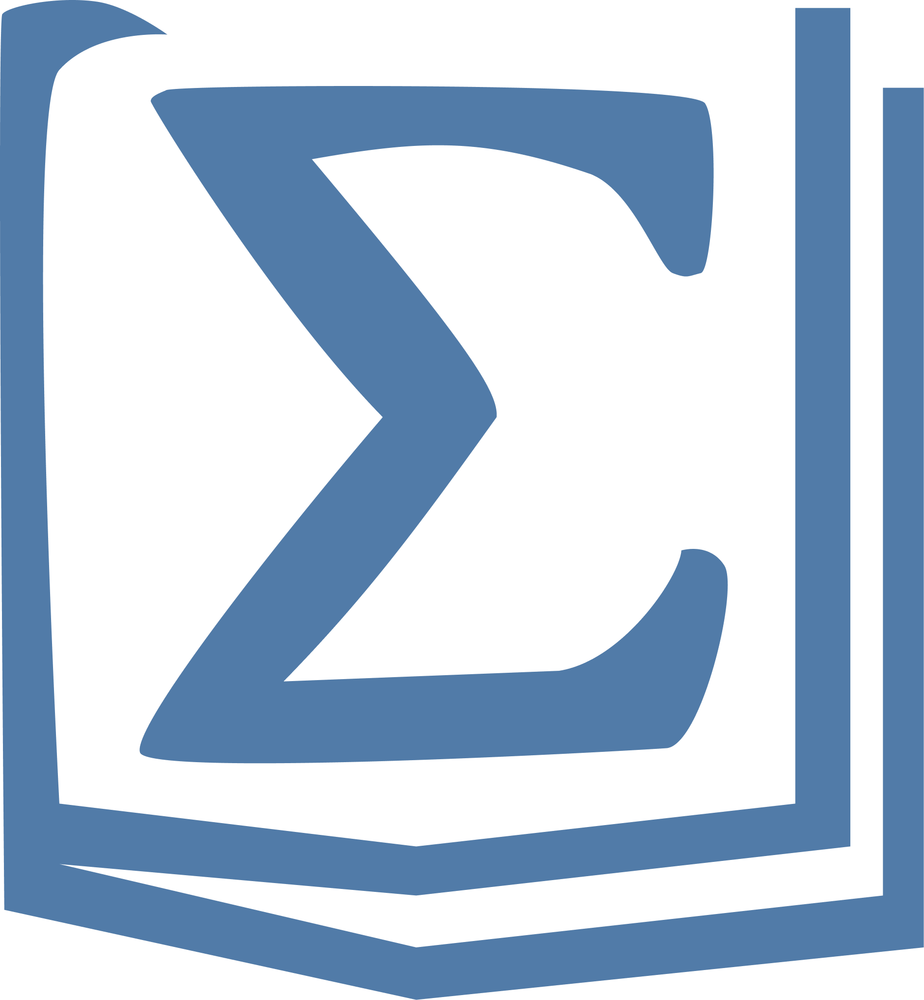

<p align="center">
  
</p>

<h1 align="center">Sigmaven</h1>

<p align="center">
  Platform literasi modern — toko buku, game edukasi, dan lelang buku langka dalam satu ekosistem.
</p>

<p align="center">
  
  
  
  
  
</p>

---

## 📖 Tentang Sigmaven

**Sigmaven** adalah platform literasi berbasis web yang menggabungkan tiga fitur utama dalam satu ekosistem:

- **📚 Toko Buku (Shop)** — Jelajahi dan beli ribuan koleksi buku fiksi & non-fiksi dari berbagai genre.
- **🎮 Sigame** — Game edukatif eksklusif untuk member premium. Kumpulkan poin dan tukarkan dengan reward menarik.
- **🏛️ LegacyBid** — Sistem lelang buku langka dan koleksi vintage eksklusif untuk member premium.

### Fitur Unggulan

| Fitur | Deskripsi |
|-------|-----------|
| 🛒 Keranjang & Checkout | Sistem pembelian lengkap dengan manajemen keranjang |
| 💳 Sistem Pembayaran | Integrasi pembayaran dengan konfirmasi order |
| ⭐ Sistem Poin | Kumpulkan poin dari transaksi, tukarkan dengan reward |
| 🏅 Membership Premium | Akses eksklusif ke Sigame dan LegacyBid |
| ❤️ Wishlist | Simpan buku favorit untuk dibeli nanti |
| 🎟️ Kupon Diskon | Sistem kupon promo dengan berbagai ketentuan |
| ⚡ Lelang Real-time | Sistem bidding dengan timer dan riwayat penawaran |
| 🛡️ Admin Panel | Dashboard lengkap untuk manajemen seluruh platform |
| 💬 Review & Rating | Sistem ulasan produk dari pembeli terverifikasi |

---

## 🛠️ Tech Stack

### Backend
- **PHP 8.3** + **Laravel 13.x** — Framework utama
- **Livewire 4.x** — Full-stack reactive components (tanpa banyak JavaScript manual)
- **SQLite** — Database (dapat diubah ke MySQL/PostgreSQL)

### Frontend
- **Alpine.js 3.x** — JavaScript ringan untuk interaktivitas UI
- **Tailwind CSS 3.x** — Utility-first CSS framework
- **Vite 5.x** — Asset bundler cepat

### Package Tambahan
- `@tailwindcss/forms` — Styling form elements
- `@tailwindcss/typography` — Styling konten rich-text
- `@alpinejs/collapse` — Animasi collapse untuk menu & accordion
- `@alpinejs/mask` — Input masking
- `blade-ui-kit/blade-heroicons` — Heroicons di Blade

---

## 🚀 Instalasi & Setup

### Prasyarat
- PHP >= 8.3
- Composer
- Node.js >= 18.x & NPM
- Git

### Langkah Instalasi

**1. Clone repository**
```bash
git clone https://github.com/[username]/sigmaven.git
cd sigmaven
```

**2. Install dependensi PHP**
```bash
composer install
```

**3. Setup environment**
```bash
cp .env.example .env
php artisan key:generate
```

**4. Konfigurasi database**

Edit file `.env`:
```env
DB_CONNECTION=sqlite
# Atau untuk MySQL:
# DB_CONNECTION=mysql
# DB_HOST=127.0.0.1
# DB_PORT=3306
# DB_DATABASE=sigmaven
# DB_USERNAME=root
# DB_PASSWORD=
```

**5. Jalankan migrasi & seeder**
```bash
php artisan migrate
php artisan db:seed
```

**6. Install dependensi NPM & build aset**
```bash
npm install
npm run build
```

**7. Jalankan server**
```bash
php artisan serve
```

Akses di `http://localhost:8000`

---

### Cara Cepat (Satu Perintah)

```bash
composer run setup
```

Perintah ini akan otomatis menjalankan: `composer install` → copy `.env` → `key:generate` → `migrate` → `npm install` → `npm run build`.

---

### Development Mode

Untuk menjalankan semua service sekaligus (server, queue, log, Vite HMR):

```bash
composer run dev
```

---

## 📂 Struktur Direktori

```
sigmaven/
├── app/
│   ├── Livewire/
│   │   ├── Admin/          # Komponen admin panel (Dashboard, Products, Orders, dll.)
│   │   ├── Auth/           # Komponen autentikasi
│   │   ├── Components/     # Komponen reusable (CartBadge, ProductCard, dll.)
│   │   └── Pages/          # Halaman utama (Homepage, Shop, Checkout, dll.)
│   ├── Models/             # Eloquent models (User, Product, Order, Auction, dll.)
│   └── Services/           # Business logic & service classes
├── database/
│   ├── migrations/         # Skema database
│   └── seeders/            # Data awal
├── resources/
│   ├── css/
│   │   ├── app.css         # CSS utama (design system aktif)
│   │   ├── app.v1.css      # Backup design system v1
│   │   └── app.v2.css      # Backup design system v2
│   ├── js/                 # JavaScript & Alpine.js config
│   └── views/
│       ├── layouts/        # Layout utama (app, admin, guest)
│       ├── livewire/       # Blade views untuk Livewire components
│       └── components/     # Blade components
└── routes/
    └── web.php             # Definisi routes
```

---

## 👥 Peran Pengguna

| Peran | Akses |
|-------|-------|
| **Guest** | Browse produk, lihat detail buku |
| **Regular Member** | Semua fitur guest + beli buku, wishlist, review, poin |
| **Premium Member** | Semua fitur regular + Sigame & LegacyBid |
| **Admin** | Akses penuh ke admin panel |

---

## ⚙️ Admin Panel

Akses admin panel di `/admin/dashboard` (memerlukan akun dengan role admin).

Fitur admin panel:
- 📊 **Dashboard** — Statistik ringkas (total order, revenue, user, produk)
- 📚 **Products** — CRUD produk buku
- 🏷️ **Genres** — Manajemen genre/kategori
- 📦 **Orders** — Manajemen & konfirmasi pesanan
- 👤 **Users** — Manajemen pengguna & role
- 🎮 **Sigame** — Manajemen konten game
- 🏛️ **Auctions** — Manajemen item lelang
- 🎟️ **Coupons** — Buat & kelola kupon diskon

---

## 🎨 Design System

Project ini memiliki dua versi design system yang tersimpan:

| Versi | Tema | Status | Lokasi Backup |
|-------|------|--------|---------------|
| **v1** | Forest Green + Gold + Cream | Aktif | `resources/views/layouts/v1/` |
| **v2** | Navy Blue + Steel Blue + Teal | Tersimpan | `resources/views/layouts/v2/` |

---

## 📝 Lisensi

Project ini dibuat untuk keperluan tugas **Pemrograman Web** oleh Kelompok 10.

---

<p align="center">Made with ❤️ for book lovers — Sigmaven &copy; 2025</p>
