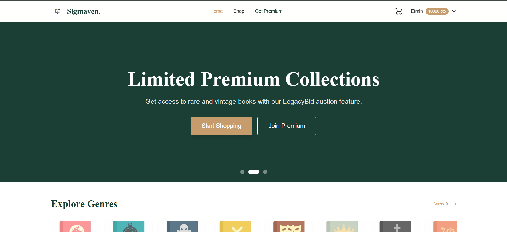
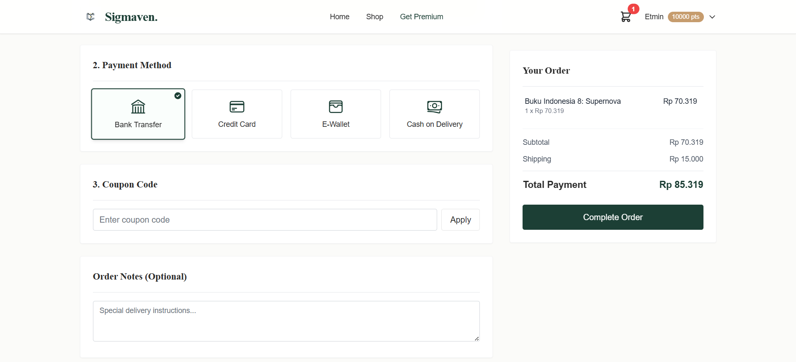
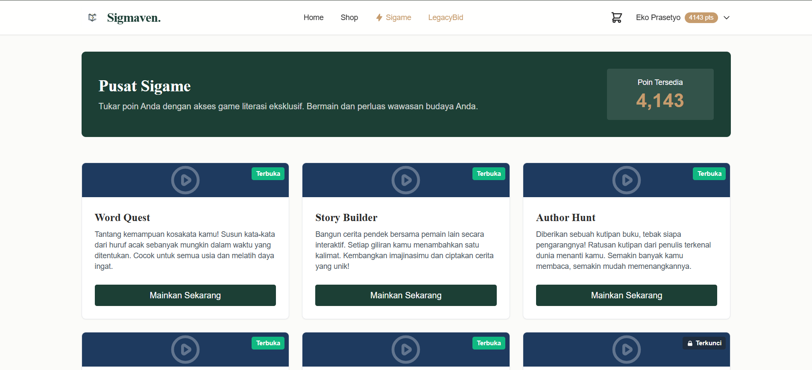
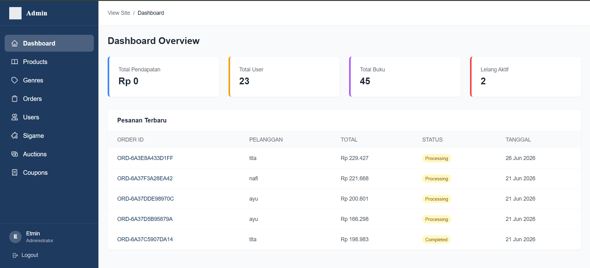

<p align="center"></p>

# Sigmaven

Sigmaven is the final project for the Web Programming 2 course (Kelompok 10). It is a full-stack e-commerce and interactive platform built on top of Laravel, Livewire, and Tailwind CSS. 

## 🚀 Features

The application incorporates various advanced features tailored for modern web applications:

### 1. E-Commerce Core
- **Product Catalog**: Browse products/books with dynamic categories (Genres).
- **Cart & Checkout**: Real-time cart subtotal calculation and dynamic shipping costs based on region.
- **Coupons & Discounts**: Validation of discount codes with expiry dates and maximum usage limits.
- **Wishlist**: Toggle products to save for later.
- **Order Management**: Comprehensive tracking of user orders and transaction states.

### 2. Interactive Features (Sigame & Auctions)
- **Sigame (Point System)**: Mini-games where users can earn points. Includes a `PointsTransaction` audit trail.
- **Auctions (Lelang)**: Real-time bidding system with pessimistic locking for concurrency handling to determine the highest bidder when the auction ends.

### 3. Roles & Security
- **Authentication**: Secure login/register system.
- **Role Management**: Middleware-protected routes differentiating between regular Users, Premium users, and Administrators.
- **Premium Subscription**: Exclusive access to certain routes (like `/sigame`) protected by `PremiumMiddleware`.

### 4. Admin Panel
- **Dashboard**: High-level statistical overview (Revenue, Total Products, Orders, Users).
- **Resource Management**: CRUD operations for Users, Products, Orders, Games, Genres, Auctions, and Coupons.
- **Dynamic UI**: Built with Tailwind CSS, featuring custom responsive grids, interactive dropdowns, and accessible modal forms for data entry.

## 🛠️ Technology Stack

- **Backend**: [Laravel 11+](https://laravel.com)
- **Frontend / Reativity**: [Livewire](https://livewire.laravel.com/) (AJAX-based partial DOM updates without page reloads)
- **Styling**: [Tailwind CSS](https://tailwindcss.com) (with custom configurations in `tailwind.config.js`)
- **Database**: MySQL (using Eloquent ORM, Migrations, Seeders, and DB Transactions)
- **Bundler**: Vite

## ⚙️ Installation & Setup

1. **Clone the repository:**
   ```bash
   git clone <your-repository-url>
   cd sigmaven
   ```

2. **Install PHP dependencies:**
   ```bash
   composer install
   ```

3. **Install NPM dependencies and run Vite:**
   ```bash
   npm install
   npm run dev
   ```

4. **Environment Configuration:**
   Copy the `.env.example` file to `.env` and configure your database settings:
   ```bash
   cp .env.example .env
   php artisan key:generate
   ```

5. **Database Migration & Seeding:**
   ```bash
   php artisan migrate --seed
   ```
   *Note: Use `php artisan migrate:fresh --seed` if you need to reset the entire database during development.*

6. **Storage Link:**
   To ensure uploaded images (like product covers and game thumbnails) are accessible:
   ```bash
   php artisan storage:link
   ```

7. **Run the local server:**
   ```bash
   php artisan serve
   ```

## 📚 Technical Implementation Highlights

- **Modified MVC**: Uses Livewire components in place of traditional controllers for real-time frontend reactivity (Hydration & Dehydration).
- **Eager Loading**: Implements `->with()` to prevent N+1 Query Problems when loading relational data (e.g., Orders and User).
- **Service Pattern**: Offloads heavy logic (like calculations and checkout processes) to Service Classes to maintain "Skinny Controllers".
- **Event-Driven Notifications**: Employs asynchronous event dispatching (`$this->dispatch('notify')`) to trigger toast messages on the frontend without reloading the page.

## 📸 Screenshots


### 1. Halaman Utama & Katalog Produk


### 2. Keranjang & Checkout


### 3. Sigame & Lelang


### 4. Panel Admin - Dashboard


## 🔑 Akun Demo (Seeder)
Jika menggunakan `php artisan db:seed`, gunakan kredensial berikut untuk login dan menguji sistem:
- **Admin**: `admin@sigmaven.com` | Password: `password`
- **User Premium**: `premium@test.com` | Password: `password`
- **User Biasa**: `regular@test.com` | Password: `password`

---
*Developed for Web Programming 2 - Kelompok 10*
